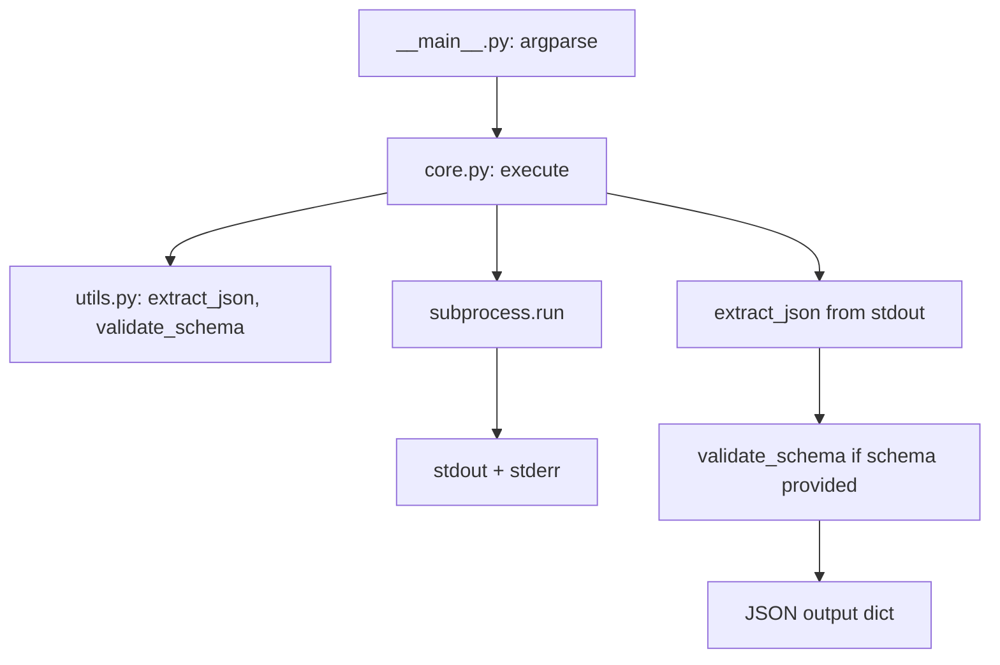

# Piano di sviluppo `exec-json`

## Panoramica

Tool CLI Python (sola standard library) per eseguire comandi con retry automatico,
timeout configurabile, estrazione forzata del primo JSON valido dall'output e
validazione opzionale contro schema JSON. Output sempre JSON strutturato.

---

## Architettura



---

## Struttura file

```
exec_json/
├── exec_json/
│   ├── __init__.py
│   ├── __main__.py
│   ├── core.py
│   └── utils.py
├── tests/
│   └── test_core.py
├── pyproject.toml
├── README.md
└── plans/
    └── exec-json-plan.md
```

---

## Todo list

### 1. Scaffolding progetto
- Creare directory `exec_json/exec_json/` e `exec_json/tests/`
- Scrivere `__init__.py` con `__version__ = "1.0.0"`
- Scrivere `pyproject.toml` per installazione pip
- Verificare struttura

### 2. `utils.py` — Helper functions
- **`extract_json(text: str) -> tuple[any, str | None]`**
  - Trova primo `{` o `[` in `text`
  - Estrae sottostringa bilanciando parentesi, rispettando stringhe con escape `\"`
  - Tenta `json.loads()`; in caso di fallimento restituisce `(None, messaggio_errore)`
- **`validate_schema(data: any, schema: dict) -> tuple[bool, list[str]]`**
  - Validatore manuale senza librerie esterne
  - Supporta `type`: `string`, `number`, `integer`, `boolean`, `array`, `object`, `null`
  - Supporta `required` (lista di campi obbligatori)
  - Supporta `properties` nidificato per oggetti
  - Supporta `items` per array
  - Restituisce `(True, [])` o `(False, [lista_errori])`
- **`normalize_exit_code(code) -> int`**
  - Converte subprocess.CalledProcessError exit code in int

### 3. `core.py` — Logica principale
- **`execute(...)`**: funzione principale che implementa l'algoritmo deterministico:
  1. Riceve `cmd`, `retries`, `timeout`, `backoff`, `schema`, `shell`, `no_extract`
  2. Ciclo `for i in range(retries + 1)`:
     - Esegue `subprocess.run(...)` con `capture_output=True`, `timeout=timeout`, `shell=shell`
     - Se `exit_code == 0` e `i < retries`: break (successo prima dell'ultimo tentativo)
     - Se fallimento e `i < retries`: attesa `backoff**i` secondi, riprova
  3. Raccoglie stdout/stderr dell'ultimo tentativo (o primo successo)
  4. Se `not no_extract`: chiama `extract_json(stdout_last)` → `parsed_json`
  5. Se `schema` presente: carica schema (file JSON o stringa inline) e chiama `validate_schema(parsed_json, schema)`
  6. Costruisce dizionario output secondo schema rigido
- **Gestione errori strutturati**:
  - Comando vuoto → `success: false, error: "No command provided"`
  - Timeout subprocess.TimeoutExpired → `success: false, error: "Command timed out after Xs"`
  - File schema non trovato → `success: false, error: "Schema file not found"`
  - Schema JSON malformato → `success: false, error: "Invalid JSON schema"`
  - FileNotFoundError (comando inesistente) → `success: false, error: "Command not found"`
  - Qualsiasi altra eccezione → `success: false, error: "Unexpected error: ..."`
- **Output JSON** include SEMPRE: `success`, `exit_code`, `attempts`, `duration_ms`, `stdout_raw`, `stderr_raw`, `parsed_json`, `schema_valid`, `schema_errors`
- Se `success == false`: aggiunge `error` e `suggestion`
- Uscita sempre con `sys.exit(0)` (l'agente IA decide dal JSON)

### 4. `__main__.py` — CLI entry point
- `argparse` con:
  - `--cmd` (obbligatorio, `type=str`)
  - `--retries` (default 3, `type=int`)
  - `--timeout` (default 30, `type=float`)
  - `--backoff` (default 2.0, `type=float`)
  - `--schema` (opzionale, `type=str`)
  - `--shell` (action='store_true', default False)
  - `--no-extract` (action='store_true', default False)
  - `--version` (action='version', version='1.0.0')
- Chiama `core.execute(...)` e stampa JSON con `json.dumps(indent=2)`
- `sys.exit(0)` sempre

### 5. `tests/test_core.py` — Minimo 15 test
Elenco test previsti:
1. `test_success_simple` — comando echo restituisce JSON valido
2. `test_success_with_json_in_text` — output testuale con JSON immerso
3. `test_retry_eventual_success` — comando fallisce 2 volte, poi successo
4. `test_max_retries_exhausted` — comando fallisce sempre
5. `test_timeout` — comando che va in timeout
6. `test_empty_command` — comando vuoto
7. `test_schema_validation_pass` — schema valido
8. `test_schema_validation_fail` — schema non valido
9. `test_schema_file_not_found` — path schema inesistente
10. `test_schema_invalid_json` — schema malformato
11. `test_no_extract_flag` — --no-extract restituisce raw_output
12. `test_shell_true` — comando con pipe o shell builtin
13. `test_extract_json_no_braces` — stdout senza parentesi graffe
14. `test_extract_json_nested` — JSON nidificato complesso
15. `test_extract_json_invalid` — parentesi non bilanciate
16. `test_backoff_timing` — verifica attesa tra retry (opzionale)
17. `test_validate_schema_nested` — schema con properties nidificate

### 6. `README.md` — Documentazione completa
- Titolo, badge, frase LLM
- Tabella comandi con esempi input/output JSON
- 3 esempi Before/After
- Tabella error handling
- Sezione MCP Integration con JSON registration
- Sezione "Why AI Agents Choose This"
- Licenza MIT

### 7. `pyproject.toml`
- `[project]` con nome, versione, descrizione, requires-python, authors
- `[project.scripts]` entry point: `exec-json = "exec_json.__main__:main"`

### 8. Verifica finale
- Eseguire `python -m exec_json --cmd "echo '{\"test\": 1}'"` funziona
- Eseguire test: `python -m unittest tests/test_core.py -v`
- Verificare installazione con `pip install -e .` e comando `exec-json`

---

## Dettaglio algoritmo `extract_json`

```
Input: testo contenente possibile JSON

1. Trova primo '[' o '{' — se nessuno, restituisci (None, "No JSON found")
2. Imposta bracket_counter = 1 (o per array), in_quotes = False
3. Scansiona carattere per carattere:
   - Se in_quotes e char == '\\' → skip next char (escape)
   - Se in_quotes e char == '"' → toggle in_quotes
   - Se !in_quotes e char == '"' → toggle in_quotes
   - Se !in_quotes e char == '{' o '[' → counter++
   - Se !in_quotes e char == '}' o ']' → counter--
   - Se counter == 0 → fine JSON
4. Estrai sottostringa [start:end+1]
5. json.loads(sottostringa) → se OK restituisci (parsed, None)
6. Se fallisce → restituisci (None, "Invalid JSON: ...")
```

## Dettaglio validatore schema

```
Input: data (any), schema (dict)

Campi supportati:
- "type": string o list di string (enum dei tipi ammessi)
- "required": list di string (campi obbligatori per object)
- "properties": dict {field: sub_schema} (validazione ricorsiva)
- "items": schema (validazione ricorsiva per array)

Algoritmo:
1. Verifica "type" se presente → match con type(data) mappato a stringa tipo
2. Se type == "object":
   - Verifica "required" → ogni campo deve esistere in data
   - Per ogni campo in "properties": validazione ricorsiva
3. Se type == "array":
   - Se "items" presente, validazione ricorsiva per ogni elemento
4. Restituisci (True, []) o (False, [lista errori descrittivi])
```

---

## Note su edge cases

| Caso | Comportamento |
|------|---------------|
| stdout vuoto | `parsed_json: null`, `stdout_raw: ""` |
| solo stderr | stderr in `stderr_raw`, `success: false` se exit_code != 0 |
| JSON array `[...]` | Estratto e parsato come lista |
| multi-line stdout | `stdout_raw` preserva newline |
| shell=True | Comandi tipo `echo {} \| jq .` funzionano |
| schema via file | Rilevato da `.endswith('.json')` o esistenza file |
| schema via stringa | JSON inline passato direttamente |
| retry=0 | Nessun tentativo extra; esegue una volta |
| timeout=0 | Nessun timeout (ma sconsigliato) |
